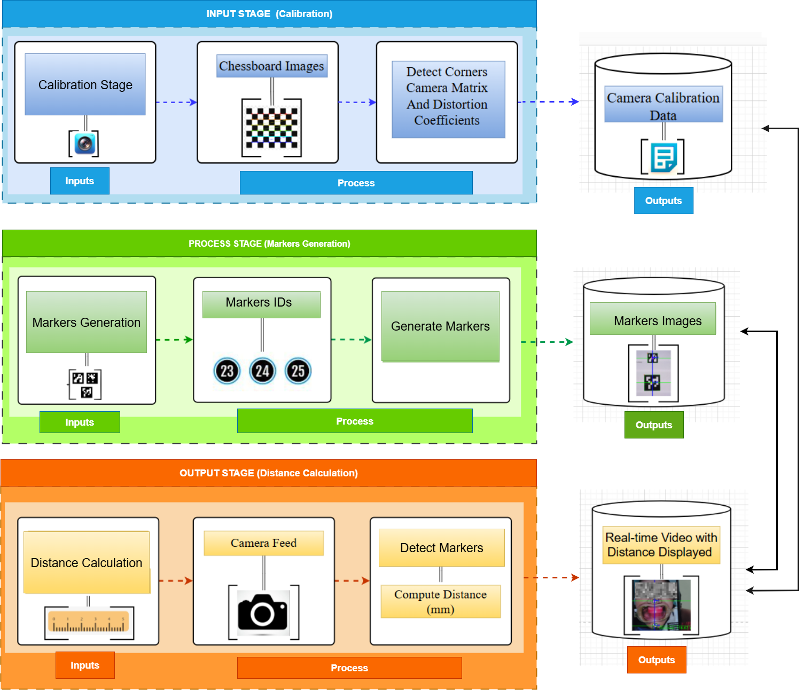
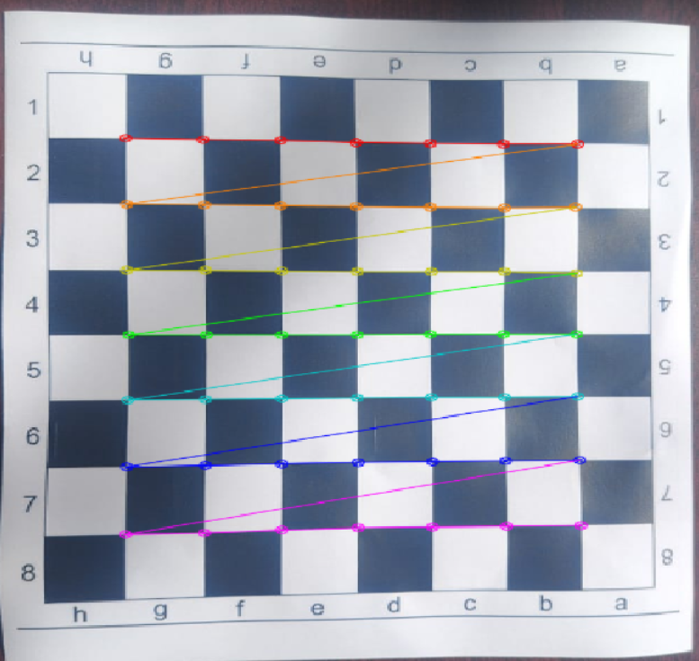
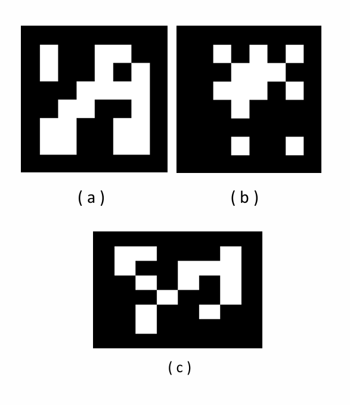
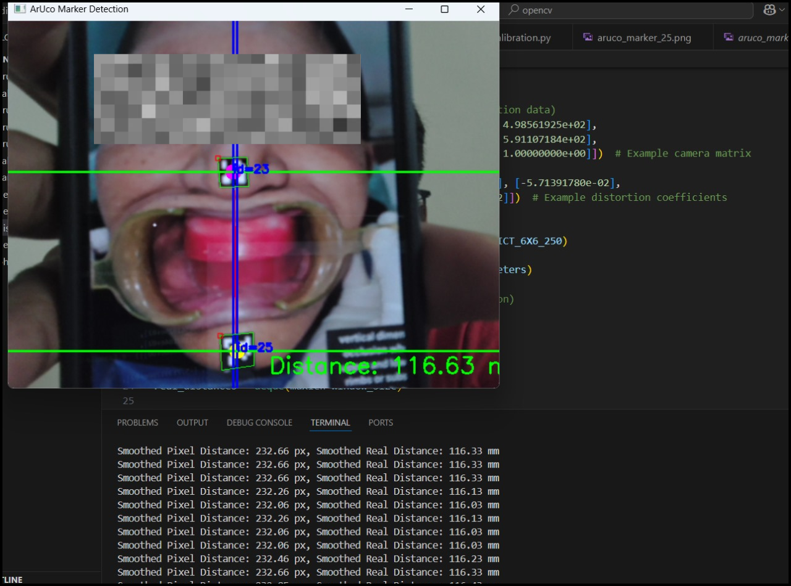

# ArUco Distance Measurement

This project implements a **computer vision system** for real-time measurement of the distance between two ArUco markers placed on the **nose and jaw region** of a subject.  
The system leverages **OpenCV**, **camera calibration**, and **ArUco marker detection** to achieve accurate, non-invasive distance estimation for potential applications in **dental and orthodontic diagnostics**.

---

##  Features
-  Camera calibration using chessboard images  
-  Generation of custom ArUco markers (IDs 23, 24, 25)  
-  Real-time detection of ArUco markers from live camera feed  
-  Calculation of distance (in millimeters) between nose and jaw markers  
-  Visualization with annotated distance display  
-  Results stored as images and graphs  

---

## 📂 Repository Structure

Aruco-Distance-Measurement/
│── calibration.py # Camera calibration using chessboard images
│── distance_calculation.py # Real-time distance measurement between markers
│── generate_aruco.py # Generate and save custom ArUco markers
│── requirements.txt # Dependencies list
│── README.md # Project documentation
│── results/ # Screenshots, histograms, figures
│ │── system_architecture.png
│ │── calibration_output.png
│ │── aruco_markers.png
│ │── real_time_demo.png
│── calibration_images/ # Chessboard images for calibration
│── LICENSE # License file (MIT)

---

## 🛠️ Installation & Setup

### 1. Clone the Repository
```bash
git clone https://github.com/salianvignesh05-droid/Aruco-Distance-Measurement.git
cd Aruco-Distance-Measurement
```

### 2. Install Dependencies
```bash
pip install -r requirements.txt
```

### 3. Run the Modules
- **Calibrate the Camera:**
  ```bash
  python calibration.py
  ```
- **Generate ArUco Markers:**
  ```bash
  python generate_aruco.py
  ```
- **Run Distance Measurement:**
  ```bash
  python distance_calculation.py
  ```

---

##  Results & Outputs

### 🔹 System Architecture


### 🔹 Camera Calibration


### 🔹 ArUco Markers


### 🔹 Real-time Measurement


---

## 📜 License
This project is licensed under the **MIT License** – see the [LICENSE](LICENSE) file for details.

---

## 👨‍💻 Author
**Vignesh N Salian**  
📍 Udupi, Karnataka, India  
🔗 [LinkedIn](https://www.linkedin.com/in/vignesh-n-salian)  
💻 [GitHub](https://github.com/salianvignesh05-droid)


